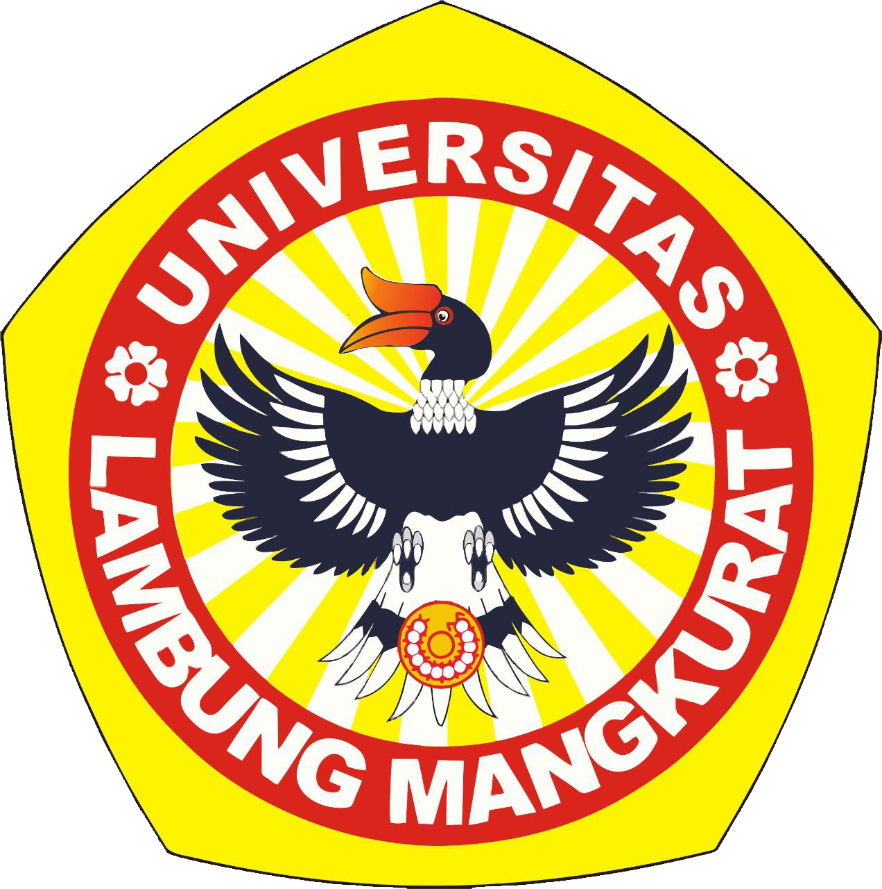

# Halftoning: Patterning dan Dithering

### Disusun oleh:

Nama Penulis: Akhmad Fitriannor  
NIM: 2310131210011  
Program Studi: Pendidikan Komputer  
Tahun: 2024/2025

### Dosen Pengampu Mata Kuliah:

Dr. Harja Santana Purba, M.Kom
Novan Alkaf Bahraini Saputra, S.Kom., M.T

---

---

---

## Daftar Isi

- [Halftoning: Patterning dan Dithering](#halftoning-patterning-dan-dithering)
- [Daftar Isi](#daftar-isi)
- [Pendahuluan](#pendahuluan)
- [Pembahasan](#pembahasan)
- [Daftar Pustaka](#daftar-pustaka)

---

## Pendahuluan

Pemrosesan citra digital merupakan salah satu bidang penting dalam teknologi informasi, terutama dalam aplikasi yang berkaitan dengan pengolahan, analisis, dan tampilan citra. Seiring dengan perkembangan teknologi, kebutuhan untuk menyajikan citra dalam kualitas yang optimal di berbagai media, seperti layar komputer, perangkat mobile, dan cetakan, semakin meningkat. Salah satu teknik yang sering digunakan dalam pemrosesan citra digital adalah halftoning, yaitu proses untuk merepresentasikan gambar bergradasi (grayscale) menggunakan titik-titik hitam dan putih pada media yang memiliki keterbatasan warna.

Halftoning digunakan secara luas dalam dunia percetakan, terutama pada perangkat yang hanya mampu mencetak dalam dua tingkat warna (hitam dan putih) atau jumlah warna yang sangat terbatas. Dalam teknik halftoning, ada beberapa metode yang sering digunakan, seperti patterning dan dithering. Patterning adalah teknik yang membagi gambar menjadi pola-pola sederhana untuk menghasilkan efek gradasi, sedangkan dithering menambahkan derau (noise) terkontrol untuk menciptakan ilusi gradasi warna yang lebih halus.

Tugas ini akan membahas lebih dalam mengenai konsep dasar halftoning, patterning, dan dithering, serta peran dan penerapannya dalam pemrosesan citra digital. Selain itu, akan diuraikan pula bagaimana teknik-teknik ini berkontribusi pada peningkatan kualitas visual gambar di berbagai media.

---

## Pembahasan

#### Digital Halftoning

Halftoning atau analog halftoning adalah proses yang mensimulasikan corak abu-abu dengan memvariasikan ukuran titik-titik hitam kecil yang tersusun dalam pola yang teratur. Teknik ini digunakan dalam percetakan, serta industri penerbitan. Jika Anda memeriksa foto di koran, Anda akan melihat bahwa gambar tersebut tersusun dari titik-titik hitam meskipun tampak tersusun dari abu-abu. Hal ini dimungkinkan karena integrasi spasial yang dilakukan oleh mata kita. Mata kita memadukan detail-detail halus dan merekam intensitas keseluruhan. Halftoning digital mirip dengan halftoning di mana gambar didekomposisi menjadi kisi-kisi sel halftone. Elemen (atau titik-titik yang digunakan halftoning dalam mensimulasikan corak abu-abu) dari suatu gambar disimulasikan dengan mengisi sel-sel halftone yang sesuai. Semakin banyak titik hitam dalam sel halftone, semakin gelap sel tersebut tampak. Misalnya, pada Gambar 1, titik kecil yang terletak di tengah disimulasikan dalam halftoning digital dengan mengisi sel halftone tengah; Demikian pula, titik berukuran sedang yang terletak di sudut kiri atas disimulasikan dengan mengisi empat sel di sudut kiri atas. Titik besar yang menutupi sebagian besar area pada gambar ketiga disimulasikan dengan mengisi semua sel halftone.

 gambar 1

#### Patterning

Teknik halftoning digital sederhana yang dikenal sebagai patterning melibatkan penggantian setiap piksel dengan pola yang diambil dari 'font biner'. Font ini dapat digunakan untuk mencetak gambar yang terdiri dari sepuluh tingkat abu-abu.

 gambar 2

#### Contoh kode patterning:

% Membaca citra grayscale

image = imread('contoh.jpeg');
if size(image, 3) == 3
image = rgb2gray(image); % Konversi ke grayscale jika gambar berwarna
end

% Mengubah citra ke tipe data double untuk memudahkan operasi
image = double(image);

% Ukuran blok untuk halftoning (misalnya 4x4)
block_size = 4;

% Matriks pola halftoning (untuk patterning sederhana)
halftone_matrix = [
8 3 4 9;
2 1 5 6;
7 11 10 12;
15 13 14 16
];

% Normalisasi matriks pola ke rentang 0 hingga 255
halftone_matrix = 255 \* (halftone_matrix - min(halftone_matrix(: ))) / (max(halftone_matrix(: )) - min(halftone_matrix(: )));

% Ukuran gambar
[rows, cols] = size(image);

% Membuat citra hasil halftoning
halftone_image = zeros(rows, cols);

% Proses patterning dengan blok
for i = 1:block_size:rows
for j = 1:block_size:cols
% Mengambil blok dari citra asli
block = image(i:min(i+block_size-1, rows), j:min(j+block_size-1, cols));

        % Mengambil ukuran aktual blok (bisa lebih kecil jika ujung gambar)
        [block_rows, block_cols] = size(block);

        % Resize matriks halftone untuk cocok dengan ukuran blok
        pattern_block = halftone_matrix(1:block_rows, 1:block_cols);

        % Melakukan halftoning dengan membandingkan pixel citra dengan pola
        halftone_image(i:min(i+block_size-1, rows), j:min(j+block_size-1, cols)) = block > pattern_block;
    end

end

% Mengubah hasil menjadi citra biner (hitam putih)
halftone_image = uint8(halftone_image \* 255);

% Menampilkan citra asli dan hasil halftoning
figure;
subplot(1, 2, 1);
imshow(uint8(image));
title('Citra Grayscale Asli');

subplot(1, 2, 2);
imshow(halftone_image);
title('Hasil Halftoning Patterning');

% Menyimpan hasil gambar
imwrite(halftone_image, 'halftone_patterning_output.jpg');

#### Output:

 gambar 3

#### Dithering

Teknik lain yang digunakan untuk menghasilkan gambar halftoning digital adalah dithering. Tidak seperti patterning, dithering menghasilkan gambar keluaran dengan jumlah titik yang sama dengan jumlah piksel pada gambar awal. Dithering dapat dianggap sebagai thresholding gambar awal dengan matriks dither. Matriks diletakkan berulang kali di atas gambar awal. Di mana pun nilai piksel gambar lebih besar daripada nilai dalam matriks, titik pada gambar keluaran akan terisi. Masalah dithering yang umum terjadi adalah menghasilkan artefak pola yang diperkenalkan oleh matriks thresholding tetap. Gambar 4 menunjukkan contoh operasi dithering. Sederhananya jika nilai pada repeated dither matrix 0 maka warna akan hitam.

 gambar 4

#### Contoh kode dithering:

% Membaca citra grayscale
image = imread('citra_grayscale.jpg');
if size(image, 3) == 3
image = rgb2gray(image); % Konversi ke grayscale jika gambar berwarna
end

% Mengubah citra ke tipe data double untuk memudahkan operasi
image = double(image) / 255; % Normalisasi ke rentang 0 hingga 1

% Ukuran citra
[rows, cols] = size(image);

% Membuat citra output untuk dithering
dithered_image = image;

% Matriks koefisien untuk Floyd-Steinberg Dithering
floyd_steinberg = [
0 0 7;
3 5 1
] / 16;

% Algoritma Floyd-Steinberg Dithering
for i = 1:rows
for j = 1:cols
% Mendapatkan nilai asli
old_pixel = dithered_image(i, j);

        % Thresholding: konversi pixel ke hitam atau putih
        new_pixel = round(old_pixel);

        % Menyimpan nilai baru (0 atau 1)
        dithered_image(i, j) = new_pixel;

        % Menghitung error (perbedaan antara nilai asli dan nilai baru)
        quant_error = old_pixel - new_pixel;

        % Menyebarkan error ke piksel tetangga menggunakan Floyd-Steinberg kernel
        for k = 1:3
            for l = 1:2
                ni = i + l - 1;  % Baris tetangga
                nj = j + k - 2;  % Kolom tetangga

                % Pastikan tidak keluar dari batas citra
                if ni > 0 && ni <= rows && nj > 0 && nj <= cols
                    dithered_image(ni, nj) += quant_error * floyd_steinberg(l, k);
                end
            end
        end
    end

end

% Mengubah hasil menjadi citra biner (hitam-putih)
dithered_image = uint8(dithered_image \* 255);

% Menampilkan citra asli dan hasil dithering
figure;
subplot(1, 2, 1);
imshow(uint8(image \* 255));
title('Citra Grayscale Asli');

subplot(1, 2, 2);
imshow(dithered_image);
title('Hasil Floyd-Steinberg Dithering');

% Menyimpan hasil gambar
imwrite(dithered_image, 'dithering_output.jpg');

#### Output:

 gambar 5

---

## Daftar Pustaka

[Digital Halftoning](https://people.ece.ubc.ca/irenek/techpaps/introip/manual04.html)

[Halftone Patterns and Dithering Techniques](https://elearn.daffodilvarsity.edu.bd/pluginfile.php/525730/mod_label/intro/0_Lecture-12_Halftoning.pdf)

[The Markdown elements outlined in the original design document](https://www.markdownguide.org/basic-syntax/)

[Markdown Center a Text, Image, Title, or Table](https://markdown.land/markdown-center)

---
